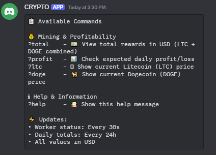
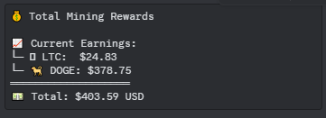
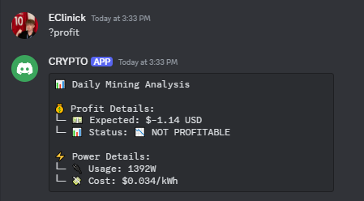
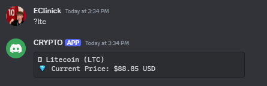
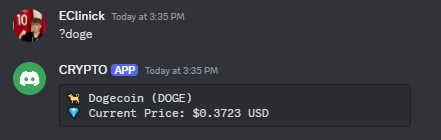

# Crypto Mining Discord Bot

A comprehensive Discord bot for monitoring cryptocurrency mining operations, specifically designed for Litecoin (LTC) and Dogecoin (DOGE) mining through litecoinpool.org.

## Table of Contents
- [Core Features](#core-features)
  - [Mining Profitability Monitoring](#mining-profitability-monitoring)
  - [Worker Monitoring](#worker-monitoring)
  - [Price Tracking & Rewards](#price-tracking--rewards)
  - [Discord Commands](#discord-commands)
- [Command Examples](#command-examples)
  - [?help Command](#help---view-available-commands)
  - [?total Command](#total---view-total-mining-rewards)
  - [?profit Command](#profit---check-mining-profitability)
  - [?ltc Command](#ltc---check-litecoin-price)
  - [?doge Command](#doge---check-dogecoin-price)
- [Environment Variables](#environment-variables)
  - [Required Variables](#required-variables)
  - [Mining Configuration Variables](#mining-configuration-variables)
- [Setup and Installation](#setup-and-installation)
  - [Prerequisites](#prerequisites)
  - [Local Installation](#local-installation)
  - [Docker Installation](#docker-installation)
- [Project Structure](#project-structure)
- [Error Handling](#error-handling)
- [Debugging](#debugging)
- [Security Considerations](#security-considerations)
- [Contributing](#contributing)
- [License](#license)
- [Setup Guides](#setup-guides)

## Core Features

### Mining Profitability Monitoring
- Automatically calculates mining profitability considering:
  - Current cryptocurrency prices (LTC & DOGE)
  - Expected mining rewards
  - Electricity costs
  - Power consumption
- Sends alerts when mining becomes unprofitable/profitable

### Worker Monitoring
- Real-time monitoring of mining worker status (30-second intervals)
- Instant notifications when:
  - Workers go offline (hash rate drops to 0)
  - Workers come back online with current hash rate
- Displays current hash rates for all workers

### Price Tracking & Rewards
- Real-time LTC price tracking
- Real-time DOGE price tracking
- Total rewards calculation in USD
- Daily profit calculations
- 24-hour reward summaries

### Discord Commands
All commands start with `?`

- `?help` - Displays available commands
- `?total` - Shows total rewards in USD (LTC + DOGE)
- `?profit` - Displays expected daily profit
- `?ltc` - Shows current LTC price
- `?doge` - Shows current DOGE price

## Command Examples

### `?help` - View Available Commands
Shows a list of all available commands and their descriptions:
<details>
<summary>View Example</summary>


</details>

### `?total` - View Total Mining Rewards
Displays your current mining rewards in both LTC and DOGE, converted to USD:
<details>
<summary>View Example</summary>


</details>

### `?profit` - Check Mining Profitability
Shows current daily profit/loss calculation based on:
- Expected mining rewards
- Power consumption
- Electricity costs
<details>
<summary>View Example</summary>


</details>

### `?ltc` - Check Litecoin Price
Shows current Litecoin (LTC) price in USD:
<details>
<summary>View Example</summary>


</details>

### `?doge` - Check Dogecoin Price
Shows current Dogecoin (DOGE) price in USD:
<details>
<summary>View Example</summary>


</details>

## Environment Variables

### Required Variables
```
DISCORD_TOKEN=your_discord_token_here
# Your Discord bot token from Discord Developer Portal
# Required for bot authentication with Discord services

CHANNEL_ID=your_channel_id_here
# Discord channel ID where the bot will send notifications
# Must be a valid Discord channel ID number
# Can be obtained by enabling Developer Mode in Discord and right-clicking the channel

LITECOINPOOL_API_KEY=your_api_key_here
# Your litecoinpool.org API key
# Required for accessing mining statistics and worker information
# Can be obtained from your litecoinpool.org account settings
```

### Mining Configuration Variables
```
POWER_USAGE=1392
# Total power consumption of your mining operation in Watts
# Used for profitability calculations
# Example: 1392W for a typical mining setup

ENERGY_COST_PER_KWH=0.034
# Your electricity cost per kilowatt-hour in USD
# Used for calculating operating costs
# Example: 0.034 for $0.034 per kWh

HOURS_PER_DAY=24
# Operating hours per day
# Default is 24 for continuous operation
# Can be adjusted if mining operation runs on a schedule
```

## Monitoring Intervals

- Worker Status Checks: Every 30 seconds
- Profitability Alerts: Every 30 seconds
- Daily Totals Update: Every 24 hours (86400 seconds)

## Setup and Installation

### Prerequisites
- Python 3.11 or higher
- Discord Developer Account
- Discord Bot Token
- litecoinpool.org Account and API Key
- Docker (optional)

### Local Installation

1. **Clone the repository:**
   ```bash
   git clone https://github.com/yourusername/crypto-discord-bot.git
   cd crypto-discord-bot
   ```

2. **Create and activate virtual environment:**
   ```bash
   python3 -m venv venv
   source venv/bin/activate  # On Windows: .\venv\Scripts\activate
   ```

3. **Install dependencies:**
   ```bash
   pip install -r requirements.txt
   ```

4. **Configure environment:**
   ```bash
   cp .env.example .env
   # Edit .env with your values
   ```

5. **Run the bot:**
   ```bash
   python discord_bot.py
   ```

### Docker Installation

1. **Configure environment:**
   ```bash
   cp .env.example .env
   # Edit .env with your values
   ```

2. **Build and run with Docker Compose:**
   ```bash
   docker-compose up --build
   ```

## Project Structure

- `discord_bot.py` - Main Discord bot implementation and event handlers
- `crypto_utils.py` - Cryptocurrency API interaction and calculations
- `profitability_tester.py` - Standalone testing tool for profitability calculations

## Error Handling

The bot includes comprehensive error handling for:
- API connection issues
- Discord connection problems
- Invalid data responses
- Channel access permissions
- Worker status monitoring
- Profitability calculation errors

## Debugging

Common issues and solutions:

1. **Bot Not Responding**
   - Verify DISCORD_TOKEN is correct
   - Check Discord bot permissions
   - Ensure bot has access to specified channel

2. **No Mining Data**
   - Verify LITECOINPOOL_API_KEY is correct
   - Check litecoinpool.org API status
   - Confirm API access permissions

3. **Incorrect Profitability Calculations**
   - Verify POWER_USAGE matches your setup
   - Confirm ENERGY_COST_PER_KWH is correct
   - Check HOURS_PER_DAY setting

## Security Considerations

- Store `.env` file securely and never commit to version control
- Regularly rotate API keys
- Use minimal required Discord bot permissions
- Monitor bot access logs
- Keep dependencies updated

## Contributing

1. Fork the repository
2. Create a feature branch
3. Commit your changes
4. Push to the branch
5. Create a Pull Request

## License

This project is licensed under the MIT License - see the LICENSE file for details. 

## Setup Guides

### Getting Litecoinpool.org API Key
1. **Create a Litecoinpool Account**
   - Visit [litecoinpool.org](https://www.litecoinpool.org)
   - Click "Register" and create an account
   - Verify your email address

2. **Generate API Key**
   - Log into your litecoinpool.org account
   - Navigate to "Settings"
   - Scroll down to the "API Access" section
   - Click "Generate New Key"
   - Copy your API key and store it securely

### Setting Up Discord Bot
1. **Create Discord Application**
   - Visit [Discord Developer Portal](https://discord.com/developers/applications)
   - Click "New Application"
   - Give your application a name (e.g., "Crypto Mining Monitor")
   - Click "Create"

2. **Create Bot User**
   - In your application, go to the "Bot" section
   - Click "Add Bot"
   - Set bot username and icon
   - Under "Privileged Gateway Intents", enable:
     - Presence Intent
     - Server Members Intent
     - Message Content Intent

3. **Get Bot Token**
   - In the "Bot" section, click "Reset Token"
   - Copy your bot token (DISCORD_TOKEN)
   - Keep this token secure and never share it

4. **Invite Bot to Server**
   - Go to "OAuth2" → "URL Generator"
   - Select the following scopes:
     - `bot`
     - `applications.commands`
   - Select bot permissions:
     - Read Messages/View Channels
     - Send Messages
     - Read Message History
     - Add Reactions
   - Copy the generated URL
   - Open URL in browser
   - Select your server and authorize

5. **Get Channel ID**
   - Open Discord Settings
   - Go to "App Settings" → "Advanced"
   - Enable "Developer Mode"
   - Right-click the channel where you want bot notifications
   - Click "Copy Channel ID"
   - This is your CHANNEL_ID

6. **Configure Bot**
   - Copy `.env.example` to `.env`
   - Add your tokens and IDs:
     ```
     DISCORD_TOKEN=your_bot_token_here
     CHANNEL_ID=your_channel_id_here
     LITECOINPOOL_API_KEY=your_litecoinpool_api_key_here
     ``` 